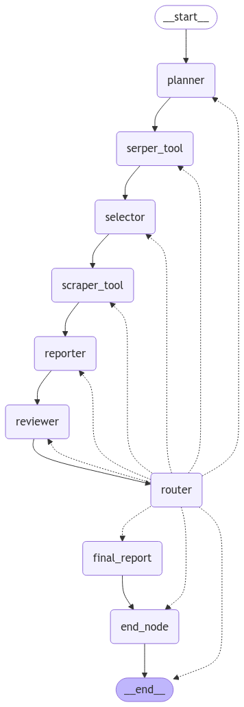

# Custom_Ai_Agent_Langgraph
# Dynamic Workflow with Custom_AI_Agent,Azure open Ai model and Google SERP API 🎯
# 🌟 Dynamic Weather Reporting Workflow with LangGraph 🌟

Welcome to the **Agentic Workflow System** for dynamically fetching query's response using the power of **Google SERP API** and **LangGraph**! 🚀

---

## 🧠 **Agent Workflow Steps**

1️⃣ **Planner Agent**:  
   Orchestrates the workflow by coordinating all other agents dynamically.

2️⃣ **Serper Tool**:  
   Fetches relevant URLs using the **Google SERP API**.

3️⃣ **Selector Agent**:  
   Selects the best URL for scraping based on relevance and quality.

4️⃣ **Scraper Agent**:  
   Extracts the weather data from the selected URL.

5️⃣ **Reporter Agent**:  
   Formats the extracted data into a meaningful and readable report.

6️⃣ **Reviewer Agent**:  
   Ensures the accuracy and quality of the data before proceeding.

7️⃣ **Router Node**:  
   Dynamically reroutes tasks to handle failures (e.g., if a URL doesn’t work, it selects another one).

8️⃣ **Final Report Generator**:  
   Compiles all validated data into the final weather report.

---

### **Workflow Diagram**



---

## ⚙️ **Environment Setup**

### **.env File Configuration**

Ensure you have a `.env` file in your project directory with the following variables:

```env
AZURE_OPENAI_API_KEY=<Your Azure OpenAI API Key>
AZURE_OPENAI_ENDPOINT=<Your Azure OpenAI Endpoint>
OPENAI_API_VERSION=<Your OpenAI API Version>
GOOGLE_SERPER_API_KEY=<Your Google Serper API Key>
